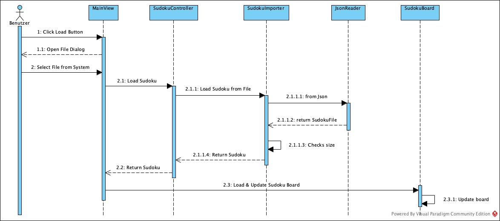
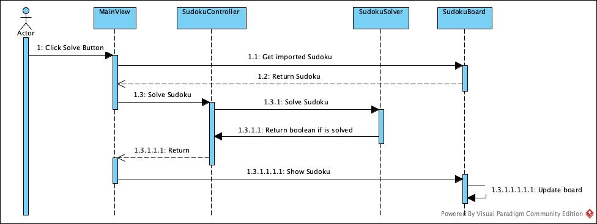

# Sudoku Solver

# Input data

The input file structure is based on this API:
http://www.cs.utep.edu/cheon/ws/sudoku/ (NEW)

#### Description

Field | Type | Description
--- | --- | --- 
size | Integer | Size of requested/created puzzle, e.g., 8 for 8x8 puzzle
squares | Array | Numbers filled in the puzzle along with their 0-based column (x) and row (y) indexes, e.g., {"x": 2, "y": 3, "value": 5}

#### Example File

```
{
	"size": "4",
	"squares": [
            {
            	"x": 0,
            	"y": 3,
            	"value": 4
            },
            {
            	"x": 1,
            	"y": 1,
            	"value": 3
            }
	]
}
```

# Import Sequence



# Solve Sequence

